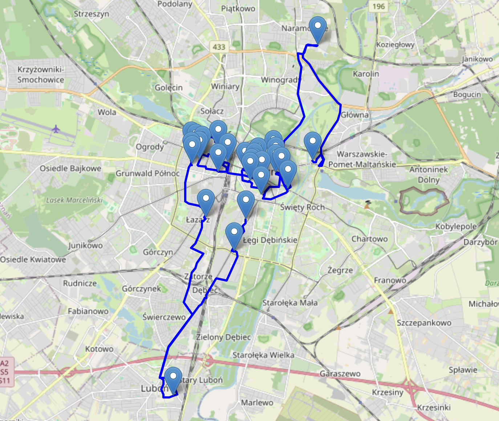

# CoffeeRaceSolver

Script created shortly before CoffeeRace 2025 in Poznań. The goal of this program it to take addresses of coffee shop to visit and calculate shortest route to visit all of them. The program uses OpenStreet Maps and solves the travelling salesman problem. It returns gpx filt compatible with for example Garmin. Html file with interactive map and points on the map. Finally .txt file with order of visited addresses.

## How to use
Download repo. Create virtal enviroment. ```python3 -m venv .venv```
Then activate `source .venv/bin/activate` enviroment and install requirements 

```pip3 install -r requirements.txt```

Having this set up in file ``adresses.csv`` paste locations you want to visit. And in `script.py` configure start and finish location in line 212.
To calculate optimal route run `python3 script.py` it can take some time to calculate but program will return files mentioned before.

